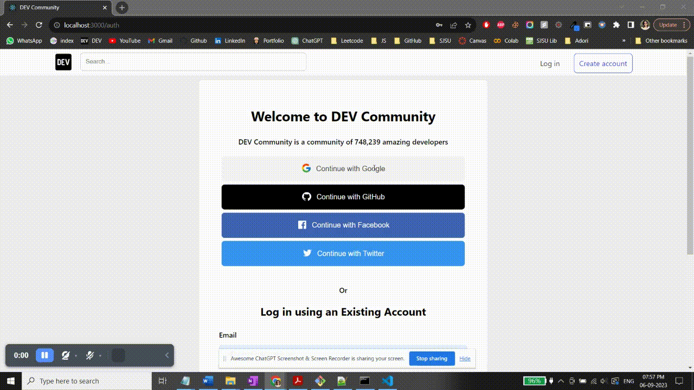
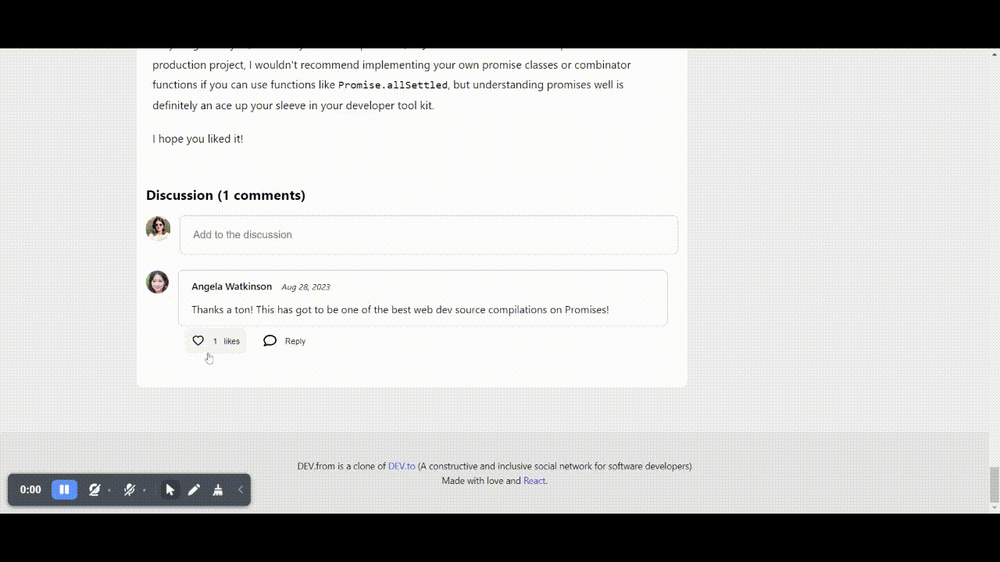

# [Dev.to](https://dev.to/) Clone using MERN stack


## Check out live

🔗

- Frontend: Hosted is on Github Pages 🔗
- Backend : Hosted is on AWS EC2 🔗
- Database: Hosted is on MongoDB Atlas 🔗

## Tech Stack Used

- **Frontend**:
  - React.js:
- **Backend** :
  - Node.js:
  - Express.js:
  - Socket.io:
  - Mongoose ORM:
- **Database**:
  - MonogDB:
  - Cloudinary:

## Features Implemented

- **Login/SignUp**

  - [x] Manual email Login/SignUp
  - [x] OAuth 2.0 - Google, Github, Facebook, Twitter

- **User**

  - [x] View / Edit user Profile
  - [x] Follow other users
  - [x] Follow Hastags
  - [x] Receive realtime notifications for replys, follows
  - [x] View Reading List

- **Post**

  - [x] Create / Update / Delete Posts
  - [x] Like / Unicorn / Save Posts
  - [x] Add hashtags to posts
  - [x] Comment to posts

- **Search**

  - [x] Search posts by names
  - [x] Search posts by hashtags

- **Realtime Notifications**

  - [x] When user comments / replies
  - [x] When user gets a follower

- **Skeleton loading**

# Screenshots

## Login/SignUp



## Create Post


## Follow Tags


## Save and Like/Unicorn Posts


## Comment / Reply for Posts



## Get Realtime Notifications for Comments, Likes


## Backend (Node.js)

This project follows a specific directory structure to maintain organization and clarity.

### Project Structure

```bash
.
└── backend/
    ├── .env
    ├── app.js
    ├── package-lock.json
    ├── package.json
    ├── config/
    │   ├── cloudinary.js
    │   └── passport-twitter.js
    ├── controllers/
    │   ├── comments.js
    │   ├── notifications.js
    │   ├── posts.js
    │   ├── tags.js
    │   └── users.js
    ├── middleware/
    │   ├── check-auth.js
    │   └── file-upload.js
    ├── models/
    │   ├── comment.js
    │   ├── http-error.js
    │   ├── notification.js
    │   ├── post.js
    │   ├── tag.js
    │   └── user.js
    ├── routes/
    │   ├── comments.js
    │   ├── posts.js
    │   ├── tags.js
    │   └── users.js
    └── utils/
        ├── index.js
        └── socket.js
```

- **`config/`** directory: This directory contains configuration files for various parts of the project.
  - `cloudinary.js`: Configuration for Cloudinary integration.
  - `passport-twitter.js`: Configuration for Twitter authentication using Passport.js.
- **`controllers/`** directory: This directory holds the controller files responsible for managing different aspects of the application's logic.
  - `comments.js`: Controller for managing comments.
  - `notifications.js`: Controller for handling notifications.
  - `posts.js`: Controller for post-related actions.
  - `tags.js`: Controller for managing tags.
  - `users.js`: Controller for user-related operations.
- **`middleware/`** directory: This directory includes middleware files used to perform actions like authentication and file uploads.
  - `check-auth.js`: Middleware for user authentication.
  - `file-upload.js`: Middleware for handling file uploads.
- **`models/`** directory: This directory contains the data models for various entities within the application.
  - `comment.js`: Model for comments.
  - `http-error.js`: Custom HTTP error model.
  - `notification.js`: Model for notifications.
  - `post.js`: Model for posts.
  - `tag.js`: Model for tags.
  - `user.js`: Model for user data.
- **`routes/`** directory: This directory houses the route files that define API endpoints and their respective handlers.
  - `comments.js`: Routes for comment-related API endpoints.
  - `posts.js`: Routes for post-related API endpoints.
  - `tags.js`: Routes for tag-related API endpoints.
  - `users.js`: Routes for user-related API endpoints.
- **`utils/`** directory: This directory contains utility files for the application.
  - `index.js`: Utility functions.
  - `socket.js`: Socket.io configuration for real-time features.

## Frontend (React.js)

### Project Structure

```bash
.
└── Frontend/
    ├── .env
    ├── package-lock.json
    ├── package.json
    ├── tree.txt
    └── src/
        ├── App.js
        ├── App.test.js
        ├── index.js
        ├── MainRouter.js
        ├── reportWebVitals.js
        ├── setupTests.js
        ├── components/
        │   ├── About/
        │   │   ├── About.css
        │   │   └── About.js
        │   ├── AppProviders/
        │   │   └── AppProviders.js
        │   ├── Auth/
        │   │   ├── FBLogin.js
        │   │   ├── GHLogin.js
        │   │   ├── GLogin.js
        │   │   ├── TwitterLogin.js
        │   │   └── Welcome.js
        │   ├── AuthorInfo/
        │   │   ├── AuthorInfo.css
        │   │   └── AuthorInfo.js
        │   ├── Avatar/
        │   │   ├── Avatar.css
        │   │   └── Avatar.js
        │   ├── Comment/
        │   │   ├── Comment.js
        │   │   ├── Comments.css
        │   │   ├── Comments.js
        │   │   ├── ReplyButton.js
        │   │   ├── DeleteComment/
        │   │   │   ├── DeleteComment.js
        │   │   │   └── DeleteCommentButton.js
        │   │   ├── EditComment/
        │   │   │   ├── EditComment.js
        │   │   │   └── EditCommentButton.js
        │   │   ├── LikeComment/
        │   │   │   ├── LikeComment.js
        │   │   │   └── LikeCommentButton.js
        │   │   └── NewComment/
        │   │       ├── CommentForm.js
        │   │       └── NewComment.js
        │   ├── FollowUser/
        │   │   ├── FollowUser.css
        │   │   └── FollowUser.js
        │   ├── Footer/
        │   │   ├── Footer.css
        │   │   └── Footer.js
        │   ├── FormElements/
        │   │   ├── BodyInput/
        │   │   │   └── BodyInput.js
        │   │   ├── ImageUpload/
        │   │   │   ├── ImageUpload.css
        │   │   │   └── ImageUpload.js
        │   │   ├── Input/
        │   │   │   ├── Input.css
        │   │   │   └── Input.js
        │   │   └── TagsInput/
        │   │       ├── TagsInput.css
        │   │       └── TagsInput.js
        │   ├── Icons/
        │   │   └── Icons.js
        │   ├── LeftSideBar/
        │   │   ├── LeftSideBar.css
        │   │   └── LeftSideBar.js
        │   ├── LoadingSpinner/
        │   │   ├── LoadingSpinner.css
        │   │   └── LoadingSpinner.js
        │   ├── MainNavigation/
        │   │   ├── Dropdown.js
        │   │   ├── MainHeader.js
        │   │   ├── MainNavigation.js
        │   │   ├── Nav/
        │   │   │   ├── Nav.css
        │   │   │   └── Nav.js
        │   │   ├── NavLinks/
        │   │   │   ├── GuestNavLinks.js
        │   │   │   ├── LoggedInNavLinks.js
        │   │   │   └── NavLinks.js
        │   │   └── SideDrawer/
        │   │       ├── SideDrawer.css
        │   │       └── SideDrawer.js
        │   ├── MiniPostList/
        │   │   └── MiniPostList.js
        │   ├── Modal/
        │   │   ├── AuthModal.js
        │   │   ├── DeletionModal.js
        │   │   ├── ErrorModal.js
        │   │   ├── Modal.css
        │   │   └── Modal.js
        │   ├── Notification/
        │   │   ├── Notification.js
        │   │   └── NotificationBody.js
        │   ├── Post/
        │   │   ├── DeletePost.js
        │   │   ├── Posts.js
        │   │   ├── PostAuthor/
        │   │   │   ├── PostAuthor.css
        │   │   │   └── PostAuthor.js
        │   │   ├── PostContent/
        │   │   │   ├── PostContent.css
        │   │   │   └── PostContent.js
        │   │   └── PostReactions/
        │   │       ├── BookmarkPost.js
        │   │       ├── LikePost.js
        │   │       ├── PostReactions.css
        │   │       ├── PostReactions.js
        │   │       ├── UnicornPost.js
        │   │       └── hooks/
        │   │           └── usePostReaction.js
        │   ├── PostImage/
        │   │   └── PostImage.js
        │   ├── PostList/
        │   │   ├── PostList.css
        │   │   └── PostList.js
        │   ├── PostPreview/
        │   │   ├── PostPreview.js
        │   │   └── PreviewReactions.js
        │   ├── PostTags/
        │   │   └── PostTags.js
        │   ├── RightSideBar/
        │   │   ├── RightSideBar.css
        │   │   └── RightSideBar.js
        │   ├── SearchBar/
        │   │   └── SearchBar.js
        │   ├── Skeleton/
        │   │   ├── Shimmer.js
        │   │   ├── SkeletonArticle.js
        │   │   ├── SkeletonElement.css
        │   │   ├── SkeletonElement.js
        │   │   ├── SkeletonForm.js
        │   │   ├── SkeletonPage.js
        │   │   ├── SkeletonPostList.js
        │   │   └── SkeletonTags.js
        │   ├── SyntaxHighlight/
        │   │   └── SyntaxHighlight.js
        │   ├── Tags/
        │   │   ├── FollowTag.js
        │   │   ├── TagItem.js
        │   │   ├── TagList.js
        │   │   ├── Tags.css
        │   │   └── Tags.js
        │   └── User/
        │       ├── UserInfo/
        │       │   ├── UserInfo.css
        │       │   └── UserInfo.js
        │       └── UserSideBar/
        │           ├── UserSideBar.css
        │           └── UserSideBar.js
        ├── context/
        │   ├── auth.js
        │   ├── search.js
        │   └── socket.js
        ├── hooks/
        │   ├── useAuth.js
        │   ├── useForm.js
        │   ├── useHttpClient.js
        │   └── useSearch.js
        ├── pages/
        │   ├── Auth/
        │   │   ├── Auth.css
        │   │   └── Auth.js
        │   ├── EditPost/
        │   │   └── EditPost.js
        │   ├── EditUserProfile/
        │   │   └── EditUserProfile.js
        │   ├── Home/
        │   │   └── Home.js
        │   ├── NewPost/
        │   │   └── NewPost.js
        │   ├── Notifications/
        │   │   ├── Notifications.css
        │   │   └── Notifications.js
        │   ├── Post/
        │   │   └── Post.js
        │   ├── ReadingList/
        │   │   └── ReadingList.js
        │   ├── SearchResults/
        │   │   └── SearchResults.js
        │   ├── Tag/
        │   │   └── Tag.js
        │   └── UserProfile/
        │       └── UserProfile.js
        ├── styles/
        │   └── main.css
        └── utils/
            ├── formConfig.js
            ├── index.js
            ├── inputValidationRules.js
            └── validators.js
```

